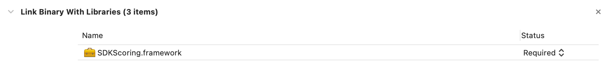
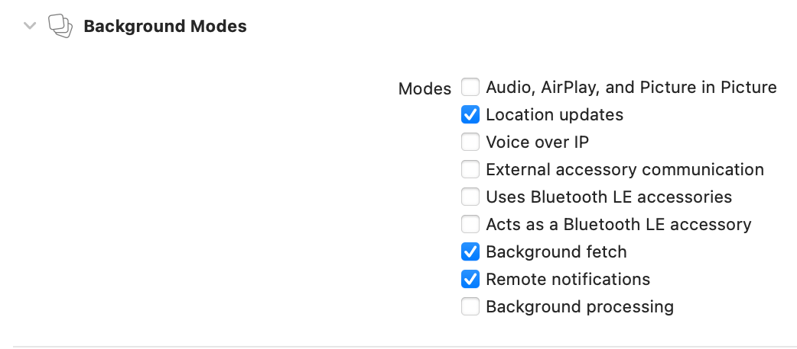

# Kasko2go Open source for iOS

Open source solution SDK for iOS description consists of the following components:
- [Steps to start an Open source project](#start)
- [Steps fоr integrating the Open source into your solutions](#integrating);
- [Description of interaction with the Open source solution APIs to obtain scoring data](#scoring);
- [Onboarding and main screens for iOS](#onboarding).


<br/>

<a name="start"></a>
## Steps to start an Open source project

To work with the Open source project you need to receive the access to our repositories on [Github][git] that contain source codes and technical documentation of the project.
Provide our [Technical Support Service][TSS] with the information about your Github user account ([Github][git] e-mail address) and receive the following access parameters:
- USER - account username;
- PASSWORD - user account password;
- NAVIGATOR_URL - navigation service address URL. 


<br/>

### Telematic data

Find the `Settings` file in the source code repository. Add the lines with access parameters received from out [Technical Support Service][TSS] to the end of the `Settings` file:
```
webAPI = “https://scoring-api.kasko2go.net/”
reciver = “receiver.kasko2go.net”
user = “<user_name>”
password = “<user_password>”
navigatorURL = “<https://navigation_url.host.com/>”
```


### Cartography service
To work with Google autocomplete service receive an **API key for the Maps SDK for iOS**. The procedure for receiving the key is described in [Using API Keys][UAPIK_iOS].
Specify the received Google **API key for the Maps SDK for iOS** in `SearchAddressViewController` file in the following form:
```
override func viewDidLoad() {
    super.viewDidLoad()
 GMSPlacesClient.provideAPIKey(“<api_key>“) 
}
```

### Firebase services

Provide interaction of your iOS application with Firebase services. For this add the `GoogleService-Info.plist` configuration file to your mobile application. Follow [this link][FB_iOS] for the procedure of adding the `GoogleService-Info.plist` configuration file to your mobile application. 

<br/>

<a name="integrating"></a>
## Steps fоr integrating the Open source into your solutions
To integrate the Open source solution SDK into your new project, you need to perform the following steps after contacting our [Technical Support Service][TSS]: 
1. Add framework to project <br/>
Download from the repository and add to your new project, for example into IDE Xcode, our framework `SDKScoring.framework`; if needed, set the flag “Copy items if needed“.  <br/>
While configuring IDE Xcode, perform the following steps:
- Set the value Embed & Sign in the General section for the framework `SDKScoring.framework`

 

- In the Build Phases section add `SDKScoring.framework` into Embed Frameworks subsection

 

- In the Build Phases section add `SDKScoring.framework` into Link Binary With Libraries subsection.

 


2. Add necessary permissions <br/>
Add  necessary permissions to your new project and ask a smartphone user to allow these permissions:
- geolocation service (requestAlwaysAuthorization)
- physical activity sensor (queryActivityStarting). 
To obtain the appropriate access rights, add the following strings to the settings file of your project Info.plist:
```
<key>NSLocationAlwaysAndWhenInUseUsageDescription</key>
<string>We use Location services to rate your driving</string>
<key>NSLocationAlwaysUsageDescription</key>
<string>We use Location services to rate your driving</string>
<key>NSLocationWhenInUseUsageDescription</key>
<string>We use Location services to rate your driving</string>
<key>NSMotionUsageDescription</key>
<string>We only use motion data to rate your driving.</string>
```


3. Background processes <br/>
Allow mobile application operation in the iOS background; to do this, set flags Location updates and Background fetch for Background Modes in the Signing & Capabilities section in IDE Xcode.

 


4. SDK configuration <br/>
To implement SDK into the required classes of your project perform: import SDKScoring.
Interaction with SDK should be done through:  public class - ScoringUserBehaviourObserver.
SDK configuration is done using the following methods. <br/>
Declaration: ``` ScoringUserBehaviourObserver.shared.setup(with userID: String, vehicleID: String, deviceID: String, isBluetoothOn: Bool, settingsArray: [[String : Any]]?, with loggingIsOn: Bool) ``` <br/>
where: <br/>


|  Name  |  Descriptoin  |
| :-------------: | :-------------: |
|  userId  |  unique identifier of the user  |
|  deviceId  |  unique identifier of the device  |
|  vehicleId  |  unique identifier of the vehicle  |
|    |  These identifiers allow to uniquely identify a user, are randomly generated by the mobile application, should be unique and have a constant value  for each user and user device. If the mobile application has been reinstalled, these identifiers are generated again.   |
|  isBluetoothOn  |  flag that indicates a bluetooth device saved by the application   |
|  settingsArray  |  an array of parameters that determine the periodicity with which the mobile application receives and sends GPS system data to the server for further processing.  |
|  loggingIsOn  |  flag resposible for collecting and sending logs to the server  |

<br/>

`settingsArray` contains the following set of parameters: <br/>

|  Name  |  Descriptoin  |
| :-------------: | :-------------: |
|  time  |  periodicity of receiving coordinates from the GPS system, time in seconds   |
|  distance  |  periodicity of receiving coordinates from the GPS system, distance travelled in metres   |
|  uspeed  |  upper vehicle speed threshold, km/h  |
|  dspeed  |  lower vehicle speed threshold, km/h  |

The mobile application will start receiving and sending GPS system data to the server for further processing after trip start validation and is described by the logic:
- if the current GPS speed >= dspeed and GPS speed < uspeed and the previous filtering state differs from the current one, then apply a new filter by time = time (in seconds) and filter by distance = distance (in meters).
- If the previous speed value was within the same limits as the current one, then do not change the filter characteristics. <br/>

`settingsArray` with default parameter values is as follows: 
<br/>


```
let exampleSettings: [[String:Any]] = [
[
"time": 18,
"distance": 200,
"uspeed": 70,
"dspeed": 0
],
[
"time": 18,
"distance": 400,
"uspeed": 110,
"dspeed": 60
],
[
"time": 18,
"distance": 600,
"uspeed": 150,
"dspeed": 100
],
[
"time": 18,
"distance": 800,
"uspeed": 190,
"dspeed": 140
],
[
"time": 18,
"distance": 1000,
"uspeed": 230,
"dspeed": 180
],
[
"time": 18,
"distance": 1200,
"uspeed": 1000,
"dspeed": 220
]]
```


5. The trip detection alrogithm is started as follows: <br/>
Declaration: `ScoringUserBehaviourObserver.shared.startMonitoringForRegion()`.
 
To avoid losing data collected by the mobile application in case of applicaton termination, go to AppDelegate of the application and in the `applicationWillTerminate` method call `ScoringUserBehaviourObserver.shared.terminated()` method:
```
func applicationWillTerminate(_ application: UIApplication) {
        ScoringUserBehaviourObserver.shared.terminated()
}
```

When connecting/disconnecting a saved bluetooth device it is necessary to use the following methods:
- Declaration: `ScoringUserBehaviourObserver.shared.pairedDeviceIsActive()` - when connecting a bluetooth device
- Declaration: `ScoringUserBehaviourObserver.shared.pairedDeviceIsInactive()` - when disconnecting a  bluetooth device


<br/>

<a name="scoring"></a>
## Interaction with the Open source solution APIs to obtain scoring data


The Open source solution SDK for iOS allows a user to get the following information:

1. Data on trips made over a specified period of time.

Use the method to receive information on trips made over a specified period of time:

Declaration: `ScoringUserBehaviourObserver.shared.getTripHistory(from beginDate: Date, to endDate: Date, tag: String, and limit: Int, with completion: @escaping ([[String : Any]]?) -> Void)`

where 
- beginDate - date/time of the beginning of the period;
- endDate - date/time of the end of the period;
- tag - trip type;
- limit - maximum number of trips returned from the server.

The method returns an array of dictionaries with the information on trips:

```
{
        "tripData": {
          "id": UUID, // Unique identifier of the trip
          "userId": UUID, // Unique identifier of the user
          "deviceId": UUID, // Unique identifier of the device
          "vehicleId": UUID, // Unique identifier of the vehicle
          "startTimestamp": 0, // Start time of the trip (UNIX timestamp)
          "finishTimestamp": 0, // Finish time of the trip (UNIX timestamp)
          "tag": "string", // A value that the trip has been tagged with
          "isBluetoothOn": true, // Is bluetooth on
          "isBluetoothConnectionEstablished": true // Is bluetooth connection establihed
        },
        "scoring": {
          "scorePercent": 0, // A score of the driving manner safety (100% indicates safe driving)
          "durationSec": 0, // The duration of the specified period (on seconds)
          "distanceMeters": 0, // The distance covered by the vehicle during the specified period
          "accidentness": 0,// An average accidentness score during the specified period
          "version": "string", // Versions of the components that affect the score
          "errors": "string" // Error information if any scoring component fails
        }

```

### Example:

```
<Array<Dictionary<String, Any>>>

  ▿ 1 : 2 elements

    ▿ 0 : 2 elements

key : "tripData"

      ▿ value : 8 elements

        ▿ 0 : 2 elements

key : userId

value : 087fbef5-d257-434a-9a21-1220cfb797cf

        ▿ 1 : 2 elements

key : deviceId

value : 720c62fc-73bf-4642-b8f6-4ad456662ae5

        ▿ 2 : 2 elements

key : id

value : f942bdc6-0e75-473f-b65f-2a5a7f58b0fe

        ▿ 3 : 2 elements

key : isBluetoothOn

value : <null> { ... }

        ▿ 4 : 2 elements

key : tag

value : driver_in_my_car

        ▿ 5 : 2 elements

key : startTimestamp

value : 1619543328

        ▿ 6 : 2 elements

key : vehicleId

value : a8bf26ed-add5-4884-9bb5-2b656f7ec4f1

        ▿ 7 : 2 elements

key : finishTimestamp

value : 1619543600

    ▿ 1 : 2 elements

key : "scoring"

      ▿ value : 6 elements

        ▿ 0 : 2 elements

key : accidentness

value : 0

        ▿ 1 : 2 elements

key : version

value : scor-1.3.0

        ▿ 2 : 2 elements

key : errors

value : 

        ▿ 3 : 2 elements

key : scorePercent

value : 100

        ▿ 4 : 2 elements

key : distanceMeters

value : 1647

        ▿ 5 : 2 elements

key : durationSec

value : 228

```


2. Detailed information on a trip that has been made.

Use the method to receive information on a specified trip:
Declaration: `ScoringUserBehaviourObserver.shared.getTripScoring(for tripID: String, with completion: @escaping ([String : Any]?) -> Void)`
where tripID - trip identifier.

The method returns a dictionary which contains detailed information on a specified trip:

```
"trip": {
      "tripData": {
        "id": UUID, // Unique identifier of the trip
        "userId": UUID, // Unique identifier of the user
        "deviceId": UUID, // Unique identifier of the device
        "vehicleId": UUID, // Unique identifier of the vehicle
        "startTimestamp": 0, // Start time of the trip (UNIX timestamp)
        "finishTimestamp": 0, // Finish time of the trip (UNIX timestamp)
        "tag": "string", // A value that the trip has been tagged with
        "isBluetoothOn": true, // Is bluetooth on
        "isBluetoothConnectionEstablished": true // Is bluetooth connection establihed
        },
      "scoring": {
        "scorePercent": 0, // A score of the driving manner safety (100% indicates safe driving)
        "durationSec": 0, // The duration of the specified period (on seconds)
        "distanceMeters": 0, // The distance covered by the vehicle during the specified period
        "accidentness": 0,// An average accidentness score during the specified period
        "version": "string", // Versions of the components that affect the score
        "errors": "string" // Error information if any scoring component fails
        }
    },
    "events": [
      {
        "timestamp": 0, // Date and time of the event (UNIX timestamp)
        "latitude": 0, // Latitude of the location point (in signed degrees format)
        "longitude": 0, // Longitude of the location point (in signed degrees format)
        "speedKph": 0, // The speed of the object at the specified time (in kilometers per hour)
        "heading": 0, // ompass direction in which the object's bow or nose is pointed (0 or 360 indicates a direction toward true North)
        "accuracy": 0 // The accuracy of the location information
      }
    ],
    "penalties": [
      {
        "timestamp": 0, // Date and time of the event (UNIX timestamp)
        "type": "string", // The type of the event
        "durationMs": 0, // The duration (in milliseconds) of the event
        "value": 0 // Indicates the severity of the event (depends on the type)
      }
    ]
}

```

### Example:

```
▿ 3 elements

  ▿ 0 : 2 elements

key : "events"

    ▿ value : 2 elements

      ▿ 0 : 6 elements

        ▿ 0 : 2 elements

key : speedKph

value : 32.76331443786621

        ▿ 1 : 2 elements

key : timestamp

value : 1619541688

        ▿ 2 : 2 elements

key : latitude

value : 48.78348541259766

        ▿ 3 : 2 elements

key : longitude

value : 44.57433319091797

        ▿ 4 : 2 elements

key : heading

value : 42.59416961669922

        ▿ 5 : 2 elements

key : accuracy

value : 27.90659523010254

      ▿ 1 : 6 elements

        ▿ 0 : 2 elements

key : speedKph

value : 32.76331443786621

        ▿ 1 : 2 elements

key : timestamp

value : 1619541689

        ▿ 2 : 2 elements

key : latitude

value : 48.78348541259766

        ▿ 3 : 2 elements

key : longitude

value : 44.57433319091797

        ▿ 4 : 2 elements

key : heading

value : 42.59416961669922

        ▿ 5 : 2 elements

key : accuracy

value : 27.90659523010254

  ▿ 1 : 2 elements

key : "penalties"

    ▿ value : 1 element

      ▿ 0 : 4 elements

        ▿ 0 : 2 elements

key : value

value : -9

        ▿ 1 : 2 elements

key : timestamp

value : 1619542035

        ▿ 2 : 2 elements

key : type

value : Acceleration

        ▿ 3 : 2 elements

key : durationMs

value : 1

  ▿ 2 : 2 elements

key : "trip"

    ▿ value : 2 elements

      ▿ 0 : 2 elements

key : tripData

        ▿ value : 8 elements

          ▿ 0 : 2 elements

key : userId

value : 087fbef5-d257-434a-9a21-1220cfb797cf

          ▿ 1 : 2 elements

key : deviceId

value : 720c62fc-73bf-4642-b8f6-4ad456662ae5

          ▿ 2 : 2 elements

key : id

value : 76464bcc-8bf3-4e55-9d57-4eba8b3cb90d

          ▿ 3 : 2 elements

key : isBluetoothOn

value : 1

          ▿ 4 : 2 elements

key : tag

value : driver_in_my_car

          ▿ 5 : 2 elements

key : startTimestamp

value : 1619541685

          ▿ 6 : 2 elements

key : vehicleId

value : a8bf26ed-add5-4884-9bb5-2b656f7ec4f1

          ▿ 7 : 2 elements

key : finishTimestamp

value : 1619542085

      ▿ 1 : 2 elements

key : scoring

        ▿ value : 6 elements

          ▿ 0 : 2 elements

key : accidentness

value : 0

          ▿ 1 : 2 elements

key : version

value : scor-1.3.0

          ▿ 2 : 2 elements

key : errors

value : 

          ▿ 3 : 2 elements

key : scorePercent

value : 82.20716546491759

          ▿ 4 : 2 elements

key : distanceMeters

value : 3385

          ▿ 5 : 2 elements

key : durationSec

value : 347

```


3. The weighted average value of the score and the total value of vehicle mileage over a certain period of time.

Use the method to receive information:

Declaration: `ScoringUserBehaviourObserver.shared.getCommonScoring(from beginDate: Date, to endDate: Date, tag: String, with completion: @escaping ([String : Any]?) -> Void)`

where
- beginDate - date/time of the beginning of the period;
- endDate - date/time of the end of the period;
- tag - trip type.

The method returns a dictionary which contains the weighted average value of the score and the total value of vehicle mileage:

```
{
    "scorePercent": 0, // A score of the driving manner safety (100% indicates safe driving)
    "durationSec": 0, // The duration of the specified period (on seconds)
    "distanceMeters": 0, // The distance covered by the vehicle during the specified period
    "accidentness": 0, // An average accidentness score during the specified period
    "tripsCount": 0 // A number of trips included into calculation of scoring
  },
```

### Example

```
<Dictionary<String, Any>>

  ▿ some : 5 elements

    ▿ 0 : 2 elements

key : "tripsCount"

value : 10

    ▿ 1 : 2 elements

key : "accidentness"

value : 0

    ▿ 2 : 2 elements

key : "scorePercent"

value : 86.92312172776988

    ▿ 3 : 2 elements

key : "distanceMeters"

value : 92094

    ▿ 4 : 2 elements

key : "durationSec"

value : 9809
```

4. Trip type change 

Changing the trip type is done by the method

Declaration: `ScoringUserBehaviourObserver.shared.setTripType(for tripID: String, tag: String, with completion: @escaping (String, Bool) -> Void)`

where
- tripID - trip identifier;
- tag - trip type to be set. 

There are four trip types:
- user as a driver of his car - “driver_in_ my_car”;
- user as a driver of someone else's car - “driver_not_in_my_car”;
- user as a passenger of a car- “passenger”;
- user travels by public transport - “public_transport”.

The method returns two variables: 
- “String” - new trip type assigned to a trip;
- “Bool” - true if the trip type has been changed, false if the trip type has not been changed.


5. Building a vehicle route/routes, getting information about dangerous road sections.

Use the request method :

`ScoringUserBehaviourObserver.shared.getRecommendedTrips(for originLat: Double, and originLon: Double, for destinationLat: Double, and destinationLon: Double, and routeTime: Int, with completion: @escaping ([RecommendedTrip]?) -> Void)`

where:
- originLat - latitude of start trip point;
- originLon - longitude of start trip point;
- destinationLat - latitude of finish trip point;
- destinationLon - longitude of finish trip point;
- routeTime - time of trip start, UNIX timestamp.

Response parameters:

Array of trips - [RecommendedTrip]

```
distance: Double = 0  // total trip mileage, metres
duration: Int = 0  // total trip duration, seconds
riskCountForUi: Int = 0  // route risk value to display on the user interface: from - 1 (bad route) to 5 (good route)
accidentRisk: Double = 0  // total route risk
lowRiskPercentage: Double = 0  // minimum risk percentage
normalRiskPercentage: Double = 0  // normal risk percentage
highRiskPercentage: Double = 0  // high risk percentage
lowRiskDistance: Double = 0  // trip mileage with low accidents risk, meters
normalRiskDistance: Double = 0  // trip mileage with medium accidents risk, meters
highRiskDistance: Double = 0  // trip mileage with high accidents risk, meters

waypoints = [Waypoint]()  // coordinates of intermediate route points 

lowRoute = [String]()  // a route with low accidents risk
normalRoute = [String]()  // a route with medium accidents risk
highRoute = [String]()  // a route with high accidents risk

baseRoute: String = “”  // base (selected) route 
lowColor = UIColor()  // colour for viewing a route with low accidents risk on the map 
normalColor = UIColor()  // colour for viewing a route with medium accidents risk on the map 
highColor = UIColor()  // colour for viewing a route with high accidents risk on the map
baseColor = UIColor()  // colour for viewing a selected route on the map 
inactiveRouteColor = UIColor()  // colour for inactive (alternative) route displaying in the user interface  
```

where:
- lowRoute, normalRoute, highRoute - arrays of routes polyline;
- baseRoute - routes polyline;
- waypoints - array of points for Google navigation service:

```
"waypoints": [
        {
          "lat": ,// latitude
          "lng":  // longitude
        },
             ]
```

<a name="onboarding"></a>
# Onboarding and main screens for iOS


When application is started for the first time, user should go through onboarding screens starting from 0.0 to 1.8. After that Main screen should be opened and it should be opened automatically every time when the app is started, user should go through onboarding screens starting from 2.0 to 4.1.
<br/>

Authorization/registration is not required.
<br/>

[Onboarding (intro & initial settings) screens ](./OP-iOS-Onboarding.pdf)


[git]: <https://github.com/>
 [TSS]: <mailto:info@kasko2go.com>
 [UAPIK_iOS]: <https://developers.google.com/maps/documentation/ios-sdk/get-api-key>
 [FB_iOS]: <https://firebase.google.com/docs/ios/setup>
 [SAA]: <>

