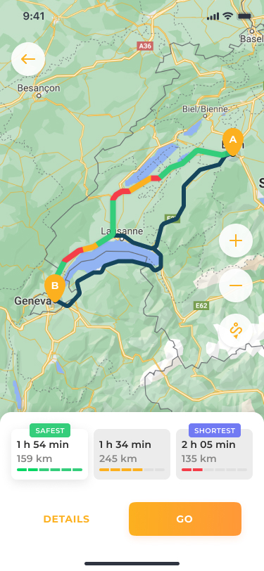
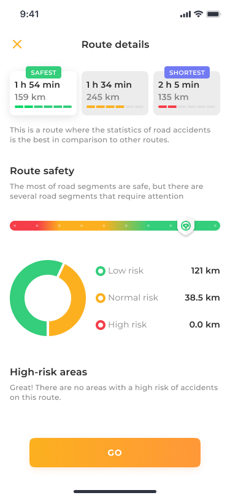
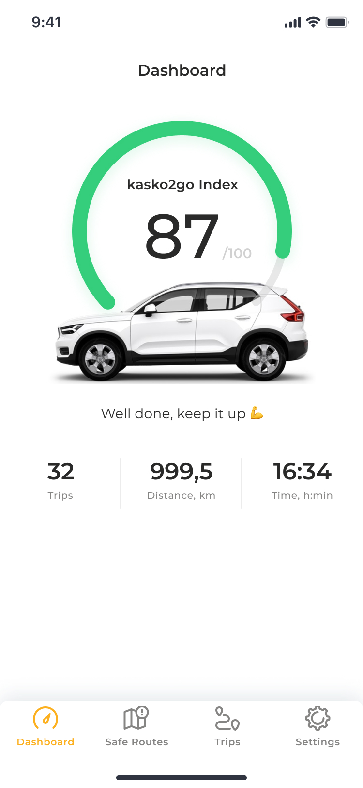
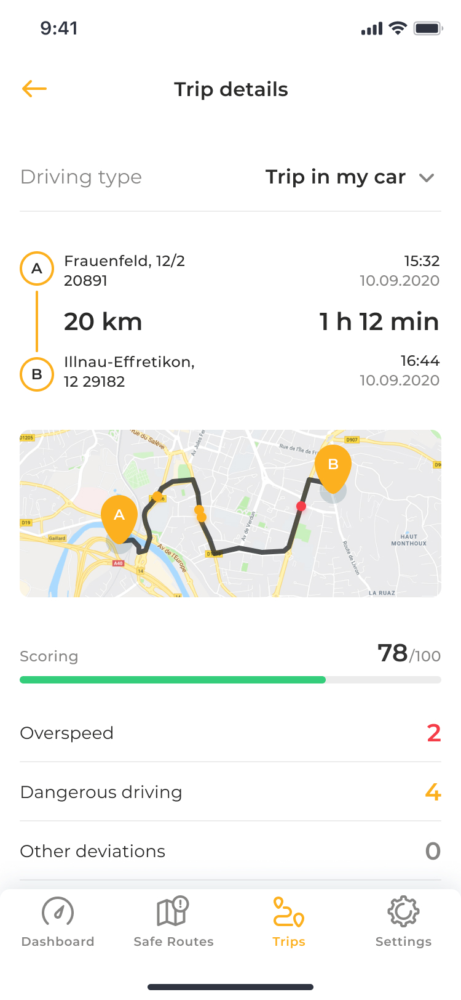

# Kasko2go Open source telematic app for Android

## _Description_
The **Kasko2go Open source** service is developed to determine a driving behaviour of a certain driver. This telematic service works with digitised road maps, has the information on static and dynamic  accident rate of different road sections.
A driver’s smartphone is used as a client telematic device. An accelerometer and a gyroscope, modules of GPS, GSM and Bluetooth systems embedded into a smartphone turn a driver’s smartphone into a source of telematic information. A mobile application installed on the smartphone transmits telematic data to servers for further processing.

## _Application Functionality:_

| Finding the “optimal route” between the start and end points of the trip  | Provides information about route safety |
| :-------------: | :-------------: |
|   |   |
| Evaluation of risk (probability) of causing an accident by a driver | Collection and primary processing of telemetry data on vehicle movement |
|   |   |

 

This free of charge app can be used to create your own app for Android and iOS.
 
For more information about Kasko2go Open Source service read the Service [documentation](./OP-doc_v1.pdf).
 
### Create your own project right now:

-  [Get started Android](./Get_started_Android.md) 
-  [Get started iOS](./Get_started_iOS.md) 

 
 
 [git]: <https://github.com/>
 [TSS]: <mailto:info@kasko2go.com>
 [UAPIK]: <https://developers.google.com/maps/documentation/android-sdk/get-api-key>
 [MSDK]: <https://developers.google.com/maps/documentation/android-sdk/start>
 [FB]: <https://firebase.google.com/docs/android/setup#add-config-file>
 [SAA]: <https://github.com/a-akulynichev/md_test/blob/main/Sample_App_%20Android.md>
 [OS_doc]: <./OP-Android-Onboarding.pdf>
